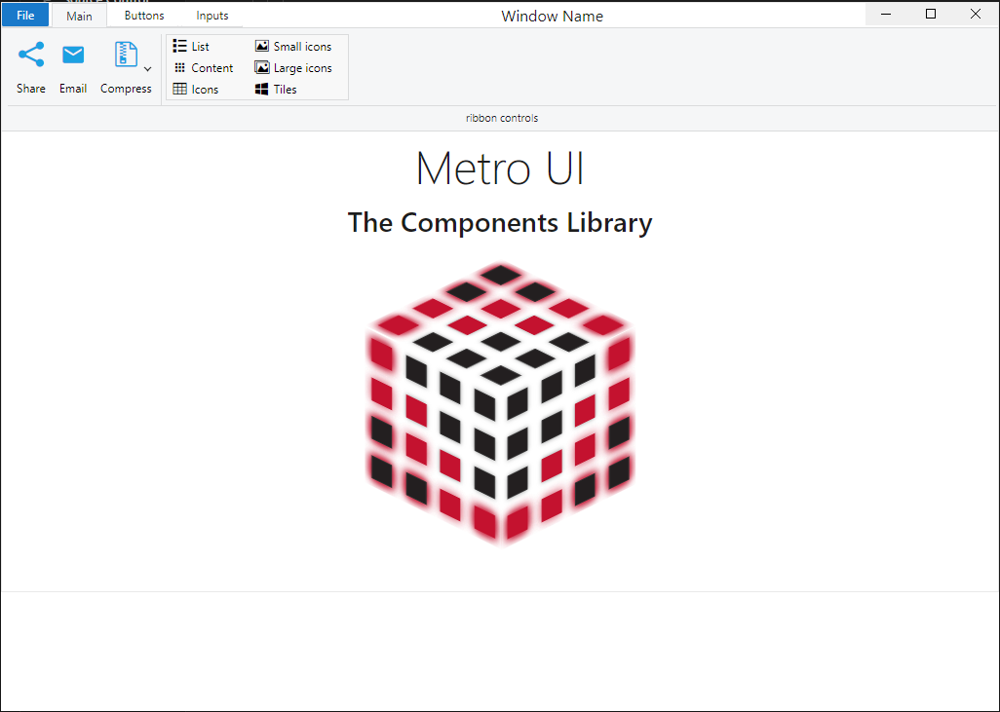

<br>
<p>
This App was created to imitate the layout of Microsoft Word
</p>
<br>
<p>
  Electron React Boilerplate uses <a href="https://electron.atom.io/">Electron</a>, <a href="https://facebook.github.io/react/">React</a>, <a href="https://korzh.com/metroui">Metro UI</a>, <a href="https://webpack.js.org/">Webpack</a> and <a href="https://www.npmjs.com/package/react-refresh">React Fast Refresh</a>.
</p>

<br>

<div align="center">

[](https://github.com/alaaet/electron-react-metro/actions/workflows/test.yml)
</div>

## Starting Development

Start the app in the `dev` environment:

```bash
npm start
```

## Maintainers

- [Alaa Abuiteiwi](https://github.com/alaaet)

## License

MIT © [Electron React Metro](https://github.com/alaaet/electron-react-metro)

